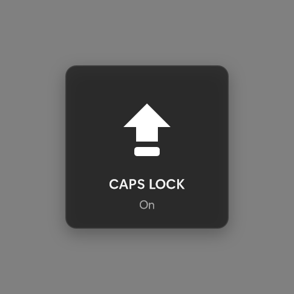
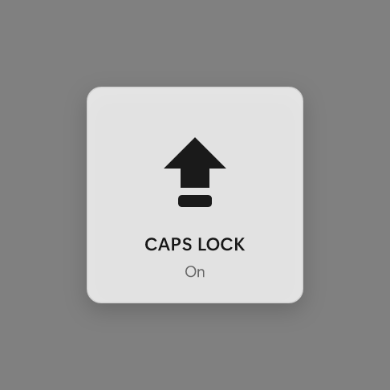
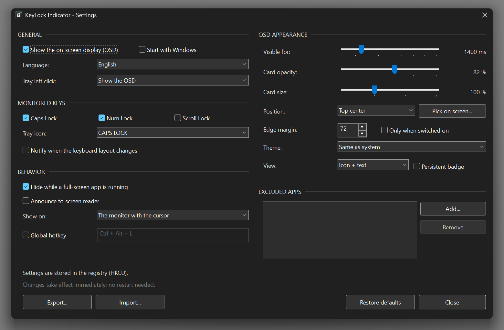

# KeyLock Indicator

**Know your lock keys. Without looking down.**

A tiny Windows tray utility that shows Caps Lock, Num Lock and Scroll Lock
on screen — the moment they change.

 

 

## What it does

Your keyboard has no lights, or you never look at them. You start typing and
suddenly EVERYTHING IS SHOUTING. KeyLock Indicator puts a small, clean card on
your screen the instant a lock key changes, then gets out of the way.

It sits in the tray, needs no runtime, installs nothing, and stays invisible
until it has something to tell you.

 

## Screenshots

| Dark theme | Light theme |
|:---:|:---:|
|  |  |

 

## The indicators

Each key has its own vector icon, drawn in code — and **on and off are different
shapes**, not just different colours, so the state stays readable if you cannot
tell those colours apart.

<table>
<tr>
<th align="left">Key</th>
<th align="center" colspan="2">On dark backgrounds</th>
<th align="center" colspan="2">On light backgrounds</th>
</tr>
<tr>
<td align="left"><b>Caps Lock</b></td>
<td align="center"> on</td>
<td align="center"> off</td>
<td align="center"> on</td>
<td align="center"> off</td>
</tr>
<tr>
<td align="left"><b>Num Lock</b></td>
<td align="center"> on</td>
<td align="center"> off</td>
<td align="center"> on</td>
<td align="center"> off</td>
</tr>
<tr>
<td align="left"><b>Scroll Lock</b></td>
<td align="center"> on</td>
<td align="center"> off</td>
<td align="center"> on</td>
<td align="center"> off</td>
</tr>
</table>

The tray icon uses the same set and swaps automatically with your Windows theme.

 

## Features

- **Instant on-screen display** — a square card with a soft shadow, drawn with
  Direct2D and composited with true per-pixel alpha
- **Never steals focus** — keep typing; the caret does not move, and clicks pass
  straight through to whatever is underneath
- **Follows your theme** — light, dark, or whatever Windows is doing right now,
  switched live
- **Sharp at any scale** — per-monitor DPI aware, so it stays crisp at 125 %,
  150 % and 200 %
- **Stays out of games** — automatically suppressed in full-screen and
  presentation mode
- **Tunable** — duration, opacity, size, position, and which keys to watch
- **Multilingual** — the interface follows your Windows language
- **Feather-light** — a single statically linked file, and it releases its GPU
  resources while idle

 

## Install

1. Download the latest ZIP from [Releases](../../releases)
2. Unzip it anywhere
3. Run `KeyLockIndicator.exe`

That is the whole thing. It is portable — no installer, nothing left behind.
Right-click the tray icon for Settings, or to start it with Windows.

 

## Good to know

- The OSD cannot draw over the UAC prompt or the secure desktop. That is a
  Windows security boundary, not a bug.
- Some exclusive full-screen DirectX games may cover it.
- Inside a VM guest window, lock state can differ from the host.

 

Building from source, architecture and measurements:
**[docs/DEVELOPMENT.md](docs/DEVELOPMENT.md)**

MIT licensed · © 2026 ShadesOfDeath

